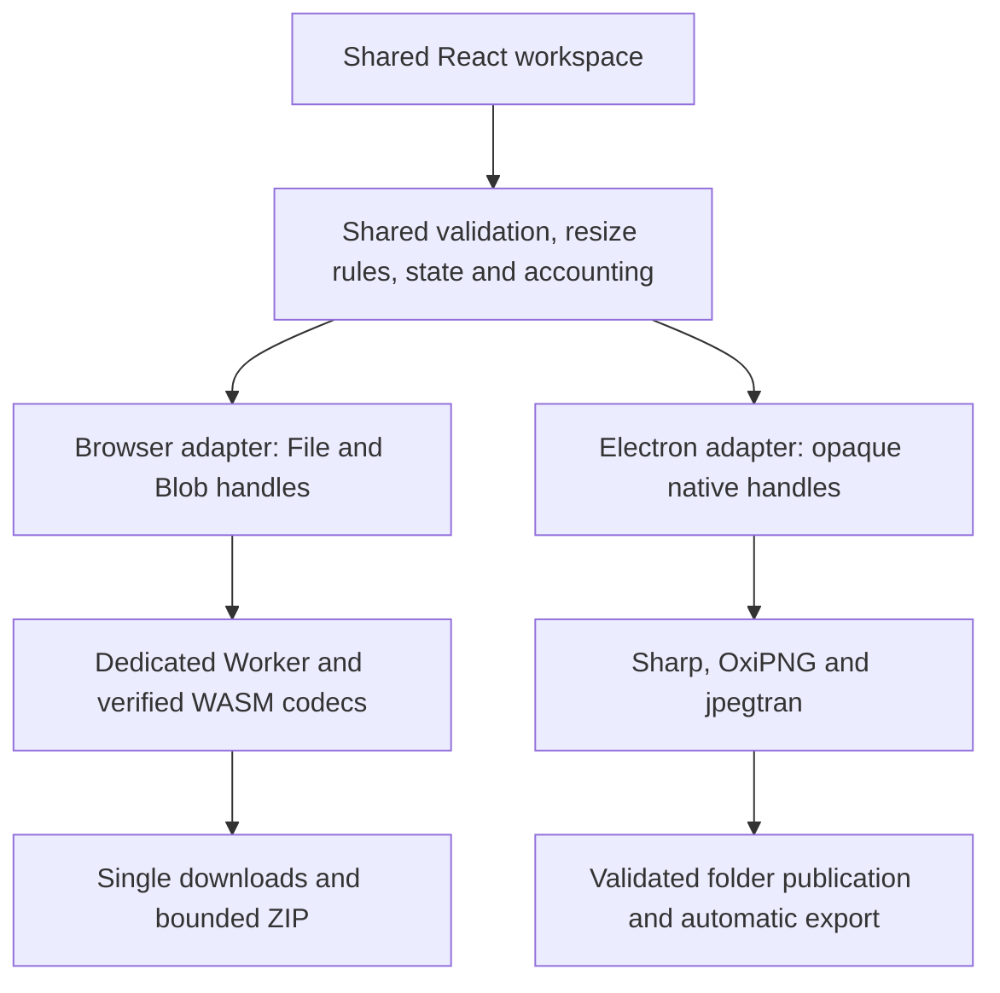

# Remage web/PWA v1.0 and desktop execution plan

Planning date: 2026-10-08, Asia/Kuching. Status: proposed execution plan; product implementation has not started for either new change. Shared design/font assets and developer REUI MCP setup are prepared separately in [design.md](../design.md) and [the tooling guide](reui-setup.md). Resource budgets and qualification thresholds below are proposed defaults, not measured capabilities or user-confirmed numeric limits.

## 1. Direction and authority

Ekko confirmed: deliver a web and PWA edition first as version 1.0; start desktop work after web stability for large/heavy batches, dependable folder workflows/automatic exports, and the existing strict native PNG/JPEG optimizer before browser parity is proved.

Keep the existing free MIT/open-source, on-device, no-account/no-upload scope. The working desktop source is retained. Version 1.0 here means the new web-first milestone; the historical macOS-first PRD and `0.1.0` package are not evidence that web v1.0 exists. Later desktop version numbering is selected during release preparation.

Sources in priority order:

1. Ekko's confirmed direction in this conversation, 2026-10-08.
2. Existing source and main OpenSpec requirements, inspected 2026-10-08.
3. Historical evidence in [verification.md](verification.md) and the completed header change; these do not prove browser, Windows, Linux, or public signing readiness.
4. The new planning artifacts linked below and current official platform documentation in section 11.

| Track | OpenSpec change | Planning artifacts | Execution status |
| --- | --- | --- | --- |
| Public web/PWA v1.0 | [release-web-pwa-v1](../openspec/changes/release-web-pwa-v1/proposal.md) | Proposal, design, four capability specs, [tasks](../openspec/changes/release-web-pwa-v1/tasks.md) | First implementation priority |
| Later desktop | [expand-desktop-platforms](../openspec/changes/expand-desktop-platforms/proposal.md) | Proposal, design, three capability specs, [tasks](../openspec/changes/expand-desktop-platforms/tasks.md) | Deferred until WEB-STABLE |

Plans authorize no public release claim. Existing main specs stay unchanged until the corresponding implementation is verified and synced/archived. Updating historical docs during implementation must retain their original evidence rather than rewrite it as new verification.

## 2. Platform choice by use case

| Platform | Best use cases | Pros | Cons and limits |
| --- | --- | --- | --- |
| Web browser | Occasional image preparation, website/app assets, quick cross-platform resize/conversion, modest mixed batches | Open a URL; no installer; local processing; one frontend release; easy source contributions/self-hosting | Browser memory/codec limits; session lost on close/reload; downloads controlled by browser; no dependable automatic folder export; strict native JPEG parity deferred |
| Installed PWA | Repeat modest batches, an app-like window, processing without connectivity after setup | Same web code/release; icon/window where supported; cached local codecs; no native installer/signing pipeline | Same browser engine/memory/file-access limits; cache can be evicted; initial/recovery connectivity needed; installation and lifecycle vary; no promise of completion after suspension/closure |
| macOS desktop | Heavy local batches, Finder/folder workflows, automatic destination exports, native strict PNG/JPEG | Existing Electron/native engine gives a head start; bundled offline dependencies; stronger filesystem control and native capacity | Installer upkeep; signing/notarization and possible developer-program cost; Intel requires its own evidence; native memory/disk still bounded |
| Windows desktop | Folder-based asset work, repeated automatic export, heavy/strict processing on Windows workstations | Shared UI/domain rules; native codecs and filesystem publication; packaged offline workflow | Windows binaries/dependencies and clean-host testing; reserved names/case/locking/reparse behavior; installer trust/signing and patch upkeep |
| Linux desktop | Developer/design workstation workflows, large local asset batches and native folder exports | Source-build/self-distribution options; native processing; same shared workspace | Distribution/libc/dependency/sandbox variation; one tested baseline does not qualify all Linux; packaging/filesystem execution needs independent evidence |

Recommended routing: quick or occasional tasks -> web; recurring modest offline work -> PWA; heavy, strict, or folder/automatic-export workflows -> desktop. Desktop is a later capability edition, not merely a wrapper around browser restrictions. Installation does not turn a PWA into a native codec/filesystem runtime.

## 3. Scope and shared architecture

### Web/PWA v1.0

Required core: local picker/drop; static 8-bit PNG/JPEG/WebP within a published color/metadata subset; conversion and resize; thumbnails/inspection; immutable batches; progress/cancel/retry; actual size accounting; individual downloads and bounded ZIP; responsive keyboard/touch UI; settings-only persistence; optional installation and verified offline readiness/update handling.

Strict browser optimization is conditional per format/subset. Start with a PNG-WASM proof; strict JPEG browser parity is not a v1.0 blocker. A failed proof disables that capability. If no strict adapter qualifies, Converter/resize remains the useful entry flow and Optimizer clearly explains its unavailable status. JPEG re-encoding cannot be presented as strict optimization.

Metadata preservation remains selected by default. If an adapter cannot fulfill it, explain and reject the operation until the user explicitly selects a supported transformation/removal policy. Unsupported profile/color interpretation must be rejected; stripping a profile cannot conceal incorrect color processing.

Excluded: uploads/processing backend, accounts/billing/telemetry, persisted image library/history, guaranteed folder writes, automatic exports, shell/Finder opening, watched folders, HEIC/AVIF/RAW/animation/high-depth support, editor/AI features, and continued work after browser closure.

### Desktop milestone after WEB-STABLE

Required: stable shared UI/domain behavior; Electron/native adapters; strict PNG/JPEG; independently measured heavier batch capacity; folder traversal and session destinations; automatic collision-safe exports and destination opening; timeout/cancel/disk cleanup; per-platform bundled codecs; clean-host release qualification.

Release sequence: macOS arm64 + Intel qualification -> Windows x64 -> one declared Linux x64 baseline. Independent support evidence is required at each step. Additional architectures, Linux package channels, app stores, auto-update services, watched folders and persistent histories remain deferred.

### One repository, two processing adapters

Keep `src/renderer` and shared rules; inject the API instead of duplicating UI. Proposed `src/web` contains browser composition, registry/preferences/export and Worker/codecs. `src/main`/`src/preload` retain native ownership. Separate web/Electron build outputs and prohibit Node/Electron/Sharp imports in the browser bundle. Capabilities and export receipts describe platform differences explicitly.

Root [design.md](../design.md) owns the shared visual language, local Atkinson/Lilex typography and violet light/dark tokens. Adopt a Radix-based REUI/shadcn Card foundation during W6. Ekko selected outline Motion Icons after written public-source redistribution permission; until that gate passes, retain current local icons and record the deferral. MCP/registry access is developer tooling and is absent from application processing dependencies.

## 4. Web execution sequence

Execute one slice at a time with one implementation owner. Each row ends in a reviewable output and a gate; subsequent rows depend on prior relevant gates. Checklist IDs refer to the web change's `tasks.md`.

| Stage | Tasks | Deliverable | Exit gate |
| --- | --- | --- | --- |
| W0 Baseline and contracts | 1.1–1.3 | Current native baseline; new v1 scope; licensed fidelity corpus; support/evidence template | Historical and new evidence distinguished; no ambiguous quality/export promise |
| W1 Platform seam | 2.1–2.4 | Injected API, runtime capabilities, observable export receipts, standalone browser entry/build | Web contains no native dependency; native workflow still works |
| W2 Codec feasibility | 3.1–3.5 | Pinned inspect/resize/format adapters; metadata decisions; strict PNG proof or disabled capability; benchmark draft | Core format/resize matrix works; unsupported fidelity is rejected; strict JPEG is not disguised as recompression |
| W3 Intake and sessions | 4.1–4.3 | Picker/drop/header validation; opaque sources/results; preferences and admission budgets | Mixed corrupt/oversize inputs are safe; originals retained; resources cleaned |
| W4 Worker execution | 5.1–5.5 | One-job scheduler, immutable settings, transformations, validation, cancel/timeouts/recovery | UI responsive; completed results survive failure/cancel; stale messages cannot publish |
| W5 Downloads/ZIP | 6.1–6.4 | Exact result downloads; deterministic ZIP entries; selection/exclusions and budget guards | Bytes/names correct; safe retry; status never implies confirmed filesystem save |
| W6 Responsive UX | 7.1–7.5 | Shared REUI/token/font foundation, mobile/desktop layouts, fidelity warnings, platform actions, accessible states and rights-gated icons | Design gate, both themes, 375px, 800x600, keyboard/screen reader, reduced motion and 200% zoom pass; icon rights or explicit deferral recorded |
| W7 Install/offline | 8.1–8.4 | Manifest/icons; complete cached asset set; explicit offline-ready status | Every advertised format works offline after verified reopen; caches contain no user images |
| W8 Updates/release prep | 9.1–9.3 | Compatible versioned assets, safe activation, multi-client handling, recovery/rollback, static hosting recipe | Active/pending work survives updates; failed precache retains old build |
| W9 Release/stability | 10.1–10.6 | Candidate checks, actual-device/production evidence, scope/license/release docs | W-01–W-12 pass and WEB-STABLE is recorded |

W2 is the first major technical checkpoint. Do not spend time polishing/installing a PWA before a useful local conversion/resize path has been proved. A browser codec supporting an encoder option does not prove source-level preservation.

### Proposed browser resource profile

These are starting ceilings to qualify or lower, not release promises. A runtime receives the conservative profile unless a higher profile has measured support. Users cannot bypass a rejected profile by selecting an unsupported native feature.

| Budget | Desktop-browser starting profile | Mobile/conservative starting profile |
| --- | --- | --- |
| Pending source count | 20 | 10 |
| Source bytes per file | 25 MiB | 20 MiB |
| Aggregate admitted source bytes | 100 MiB | 50 MiB |
| Source and planned output pixels per image | 20 million each | 12 million each |
| Source and planned output maximum dimension | 8,192 pixels, also constrained by pixel budget | 8,192 pixels, also constrained by pixel budget |
| Active image jobs | 1 | 1 |
| Retained encoded result bytes | 100 MiB | 50 MiB |
| ZIP result bytes plus overhead | 100 MiB | 50 MiB |
| Combined working-set reservation | Calibrate and publish at W2; include all retained data and transient allocations | Calibrate on the weakest supported device at W2; include all retained data and transient allocations |

Before decode/resize/encode allocation, admission must check orientation-normalized source and rounded planned output dimensions/pixels, including enabled enlargement, and reserve source/output rasters, encoder/WASM/validation scratch space and retained session data. A small source cannot bypass output limits. Independent encoded-data ceilings do not imply a safe total resident-memory guarantee. Stop/resume or reject before adding a result beyond retention capacity; do not evict an unexported result silently. Offer clear results/individual downloads/smaller selections. Native's 200-file/512-MiB/40-MP values must not be copied into web.

ZIP creation runs incrementally in a cancellable dedicated Worker. Pause new image scheduling and wait for the active image job to finish or be explicitly cancelled before archive allocation. Reserve retained sources/results/thumbnails plus the archive, transfer/temporary copies and Worker scratch space together, including any idle image Worker's retained WASM heap or terminating that Worker first. If the combined measured profile cannot admit them, block archive creation and offer smaller selections/individual downloads. The serialized ZIP ceiling alone is insufficient.

Measure 1-, 12- and 16-MP fixtures plus exact profile boundaries, unsupported boundaries and encoded-output expansion. Record hardware, browser/OS, corpus hash, codec configuration, build, init time, p50/p95 processing time, available memory observations and cleanup counters. Browser memory measurement gaps must be stated; use owned-buffer/registry/Worker/object-URL counters as additional evidence, not as proof of total process memory.

Proposed responsiveness target on named benchmark devices: cancellation acknowledgement within 150 ms and active Worker teardown within one second; reduce supported workload if the target is not met. This is a target, not an observed result or a universal device guarantee. Codec deadlines are calibrated during W2 and published with the verified limits.

## 5. WEB-STABLE handoff gate

The gate is evidence-based, not a fixed waiting period. Every blocking criterion passes on the actual declared support matrix, and there are no unresolved source corruption, privacy, false fidelity, crash, supported core-flow, cancellation, or incompatible-update defects.

| ID | Required evidence | Main tasks |
| --- | --- | --- |
| W-01 Capability matrix | Every advertised PNG/JPEG/WebP pair, output signatures/types/dimensions, unsupported input rejection and unavailable-codec states | 3.1–3.4, 5.2–5.3, 10.2 |
| W-02 Fidelity/disclosures | Real orientation/ICC/EXIF/alpha/hidden-RGB corpus; strict versus transform labels; JPEG background/loss; exact metadata policy; unsupported cases rejected | 1.3, 3.2–3.4, 5.2–5.3, 7.3 |
| W-03 Safe intake/resources | Picker/drop equivalence, mixed failures, source and planned-output admission before allocation, oversized enlargement, retained-output expansion and measured weakest-device budgets | 3.5, 4.1–4.3, 5.2, 10.3 |
| W-04 Worker lifecycle | Responsive controls, queued/active cancellation, stale result rejection, crash/timeout recovery and no incomplete publication | 5.1, 5.4–5.5, 10.3 |
| W-05 Immutable batches | Mode/format/resize/metadata changes cannot alter submitted/completed results; requeue uses originals | 4.2, 5.1, 5.5 |
| W-06 Accounting | Actual mixed-status counts and source/result totals; larger conversions retain signed increases; invalid strict outputs never export | 5.2–5.5 |
| W-07 Downloads/ZIP | Exact result bytes, Unicode/duplicate/traversal-like names, exclusions, empty selection, combined transient-memory admission, Worker responsiveness, archive cancel/failure/retry, observable download wording | 6.1–6.4 |
| W-08 Privacy/storage | Observe network and persistent storage during processing/export/update; no image/thumbnail/filename/history leakage or persisted session handles | 4.2, 8.3, 10.2–10.4 |
| W-09 Offline completeness | First complete cache, offline tab reload and installed restart, every required codec; codec eviction recovery with a runnable shell; complete eviction requiring online reopen | 8.1–8.4, 10.2–10.4 |
| W-10 Update integrity | N to N+1 with active/pending work and multiple clients, including unresponsive clients; no mixed assets; app-controlled failed-update fallback/old cache retention; rollback | 9.1–9.3, 10.4 |
| W-11 Accessibility/layout | Root design gate, both themes/font roles/contrast, keyboard, announcements/dialog focus, touch, narrow layouts, reduced motion and 200% zoom; installation guidance checked by surface | 7.1–7.5, 8.1, 10.2 |
| W-12 Production evidence | Candidate checks plus served artifact/device matrix, repeated batches, issue triage, support/limits/license docs and exact version/build record | 10.1–10.6 |

Minimum proposed matrix: current stable Chrome, Firefox and Safari on named desktop OS hosts; Edge core-flow smoke; real Android Chrome and iPhone Safari. Installed surfaces: a verified desktop Chrome/Edge target, Android Chrome and iOS home-screen PWA. Record exact versions at verification time; do not claim installation support solely from ordinary tab tests or mobile support from viewport emulation.

Run 20 consecutive representative mixed-batch cycles with clear/requeue and at least five cancellation cycles on each supported browser engine. Require zero crashes/invalid exports/stuck work and no accumulating application-owned resources after teardown. Exercise the maximum supported limits on the weakest named supported device. Complete at least one offline reopen and N-to-N+1 safe update cycle against the served artifact. Manual issue reports are sufficient; no telemetry is introduced to measure stability.

WEB-STABLE record must identify commit/artifact/version, date, tested matrix, fixture corpus, budgets, each W gate's evidence, open non-blocking issues/limitations, and QA/technical review conclusion. If a required gate fails, fix it or explicitly revise the release support contract; do not quietly call it stable. Readiness of OpenSpec files alone cannot unlock desktop implementation.

## 6. Desktop execution sequence

| Stage | Tasks | Deliverable | Exit gate |
| --- | --- | --- | --- |
| D0 Handoff | 1.1–1.3 | WEB-STABLE evidence, implemented shared contract review, fresh native baseline | Web dependency satisfied and native support matrix declared |
| D1 Native integration | 2.1–2.3 | Shared UI with trusted native adapter and correct native export receipts | Browser regressions absent; paths/security boundaries preserved |
| D2 Strict conformance | 3.1–3.4 | Packaged PNG/JPEG proof corpus and truthful strict capability matrix | D-02 passes on initial macOS target |
| D3 Heavy execution | 4.1–4.4 | Bounded enumeration/snapshots, memory/disk budgets, watchdog/cancel/cleanup | D-04 measured capacity and failure recovery pass |
| D4 Folder/export reliability | 5.1–5.4 | Automatic session destination exports, safe collision publication, open/retry | D-03 passes on the supported filesystem |
| D5 macOS qualification | 6.1–6.4 | Bundles, checksums/notices, trust preparation, downloaded arm64/Intel checks | Advertise only independently verified macOS targets |
| D6 Windows qualification | 7.1–7.4 | Pinned Windows codecs, one installer, native naming/path/process tests | D-01–D-05 on clean declared Windows x64 host |
| D7 Linux qualification | 8.1–8.4 | Pinned Linux codecs, one declared distro/libc/artifact baseline | D-01–D-05 on clean declared Linux x64 host |
| D8 Closure | 9.1–9.3 | Shared regression evidence, exact release matrix, source/release/rollback docs | Advertised targets verified; deferred targets recorded explicitly |

Initial heavy qualification targets: a 200-file supported mixed-image corpus within the existing aggregate-source budget, and separate 24–40 MP single-image/max-job tests. Exploratory 500/1,000-small-file workloads can establish a later count increase with bounded enumeration/spooling; they are not initial promises. Measure processing throughput, UI/cancel responsiveness, peak memory, temporary disk growth, disk-full recovery and source hashes. Increase beyond the current native limits only when measured headroom supports it; desktop is more controllable, not unlimited.

| ID | Desktop release evidence |
| --- | --- |
| D-01 Shared behavior | Source/settings/state/accounting/resize/cancel semantics consistent; differences explicitly documented; web regression checks pass |
| D-02 Native strict fidelity | Real corpus with samples/hidden RGB/ICC/EXIF/orientation/color/JPEG coefficient-preserving path, smaller/unchanged/error and packaged codec execution |
| D-03 Filesystem/automatic export | Authorized folders/destinations, originals unchanged, duplicate/reserved/case names, links/traversal and destination changes during publication, permission/deleted destination/disk/interruption failures, retained candidate retry |
| D-04 Heavy resources | Documented native source/planned-output limits and pre-allocation working-set admission, oversized enlargement rejection, concurrency, repeated heavy jobs, bounded disk/memory, codec deadlines/cancellation, clear/exit/orphan cleanup |
| D-05 Platform artifact | Actual downloaded clean-host app launch/probes/processing/export/offline/accessibility, compatible codecs/notices/checksums, accurate signing and OS/architecture support |

Public signing, certificate acquisition, source publication and binary hosting are release actions to prepare after a concrete artifact exists. An unavailable signing identity or target host blocks only that target's public qualification; it does not justify claiming its checks passed.

## 7. Solo execution and review ownership

Use the project's on-demand roles rather than maintain a standing team. One developer owns overlapping UI/contracts/code at a time; independent product/architecture/QA reviews can run concurrently.

| Role | Bounded responsibility | Review output |
| --- | --- | --- |
| Product manager | Scope, user flow, support boundary and acceptance | Capability/use-case alignment and unresolved decisions |
| Technical lead | Adapter contracts, fidelity, resource/security/update design | Architecture/risk review and evidence gaps |
| UI/UX designer | Responsive flow, accessibility, platform/quality language | Pre/post-implementation flow and viewport findings |
| Developer | One dependency-ordered implementation slice | Working slice plus checks actually run |
| QA | W/D requirement-to-test traceability and actual artifact checks | Exact pass/fail evidence and reproducible defects |
| Lead orchestrator | Reconcile scope/reviews and control handoffs | Release/stability decision with remaining limitations |

Every meaningful slice ends with relevant unit/integration checks, UI/browser evidence where applicable, QA findings resolved, and technical review. Do not write mirror tests for cosmetic changes. Do not repeatedly broaden passing checks unless a new change/failure justifies it.

## 8. Effort planning and stop conditions

Use gates rather than a promised launch date. Timebox the first codec/support spike to roughly 2–3 focused developer days as an estimate; if core formats/metadata or resource safety remain unproved, report the exact blocker and re-estimate instead of silently expanding into custom codec development. After W2, estimate the remaining slices using the proven support matrix.

Desktop effort is estimated after WEB-STABLE and a fresh native baseline. Host access, signing credentials, OS-specific publication behavior and available codec binaries can dominate release lead time. Start macOS first to reuse implemented work; complete one target's evidence before taking on the next. No hired team or recurring backend operations are assumed.

Stop/hold a release for corrupted or overwritten sources/results, private data leakage, unsupported fidelity advertised as strict, unsafe memory/disk behavior, unbounded codec hangs, incorrect result accounting, or destructive updates. Non-blocking improvements can remain as issues with explicit limitations.

## 9. Risks, dependencies and alternatives

| Risk/dependency | Web/PWA action | Desktop action |
| --- | --- | --- |
| Codec API/version/security changes | Pin/test/bundle WASM modules behind small adapters; publish support subset; retain notices | Pin/checksum native binaries and target libraries; probe packaged execution; patch qualified releases |
| Memory/CPU/retained outputs | Conservative single-worker profiles, header admission, decoded budgets, bounded ZIP and cleanup | Independent memory/disk qualification, spool snapshots, bounded concurrency/watchdogs |
| Metadata/color/quality promises | Reject unsupported policy; explicit transformation/removal; strict proof or disable | Preserve current strict contract; expand real-file/package corpus |
| Browser/OS API limitations | Standard picker/download core; optional installation; directory writing deferred; cache/lifecycle disclosed | Test permissions/links/locking/reserved names and safe publication by OS/filesystem |
| Update/distribution failure | Versioned coherent asset caches, safe multi-client activation and rollback | Compatible versioned installers/codecs, trust preparation, previous-bundle rollback |
| Vendor lock-in/cost | Static self-hostable artifact, local codecs, no paid image API; hosting still serves initial app assets | OSS framework/codecs, no processing API; OS trust/signing can incur cost and policy changes |

Alternatives ranked lower: Tauri adds a migration without resolving browser codec compatibility; a hosted Node image service adds uploads/security/retention/compute work and conflicts with the chosen local scope; a fresh framework rewrite duplicates React behavior; immediate three-OS release multiplies qualification work before web stability. Reconsider a shared WASM engine only when fidelity/performance evidence makes it preferable to independent engines.

## 10. Evidence and documentation to produce during implementation

- Add a web-specific verification record alongside historical native evidence. Record commands actually run, artifact/build identity, exact browser/PWA/OS/device versions, fixtures/settings, measured limits/performance and access limitations.
- Prepare browser and desktop capability/format tables independently. Do not reuse native tests as proof of browser parity or an arm64 smoke as proof of Intel/Windows/Linux.
- Update README/setup/build/architecture/product documents to describe the implemented web-first release and later desktop status; retain historical records and references.
- Update notices for every redistributed codec/font/tooling asset; verify actual license files rather than infer permission from a package name.
- Prepare concise contributor guidance and issue templates asking for build/browser/OS, synthetic reproduction files and steps without requesting private image uploads.

## 11. Source references

Project evidence inspected 2026-10-08: [README](../README.md), [product requirements](product-requirements.md), [architecture](architecture.md), [verification](verification.md), [current typed API](../src/shared/contracts.ts), [native engine](../src/main/services/image-engine.ts), [native limits](../src/main/services/intake.ts), [native codec paths](../src/main/services/capabilities.ts), [codec acquisition](../scripts/fetch-codecs.mjs), [workspace CSS](../src/renderer/src/styles.css), [strict spec](../openspec/specs/lossless-optimization/spec.md), [safe batch/export spec](../openspec/specs/safe-batch-export/spec.md).

Official/upstream references inspected 2026-10-08:

- [Sharp installation/WASM](https://sharp.pixelplumbing.com/install/#webassembly): its optional WASM runtime does not support browsers; use separate browser codecs.
- [jSquash codecs](https://github.com/jamsinclair/jSquash), [PNG optimizer API](https://github.com/jamsinclair/jSquash/tree/main/packages/oxipng), [JPEG encode/decode API](https://github.com/jamsinclair/jSquash/blob/main/packages/jpeg/README.md): candidates to evaluate; API availability does not prove strict parity.
- [Directory input](https://developer.mozilla.org/en-US/docs/Web/API/HTMLInputElement/webkitdirectory) versus [directory picker/write authorization](https://developer.mozilla.org/en-US/docs/Web/API/Window/showDirectoryPicker): distinguish read intake from permission-dependent destination writing.
- [PWA installation](https://web.dev/learn/pwa/installation), [service workers](https://web.dev/learn/pwa/service-workers), [caching](https://web.dev/learn/pwa/caching), [storage quotas/eviction](https://developer.mozilla.org/en-US/docs/Web/API/Storage_API/Storage_quotas_and_eviction_criteria): installation/offline readiness and persistent cache limitations need actual release verification.
- [Electron cross-platform runtime](https://www.electronjs.org/docs/latest/), [code signing](https://www.electronjs.org/docs/latest/tutorial/code-signing), [Tauri architecture](https://v2.tauri.app/start/), [Tauri webviews](https://v2.tauri.app/reference/webview-versions/): retaining Electron uses current work; alternative shells do not remove platform codec/distribution qualification.
